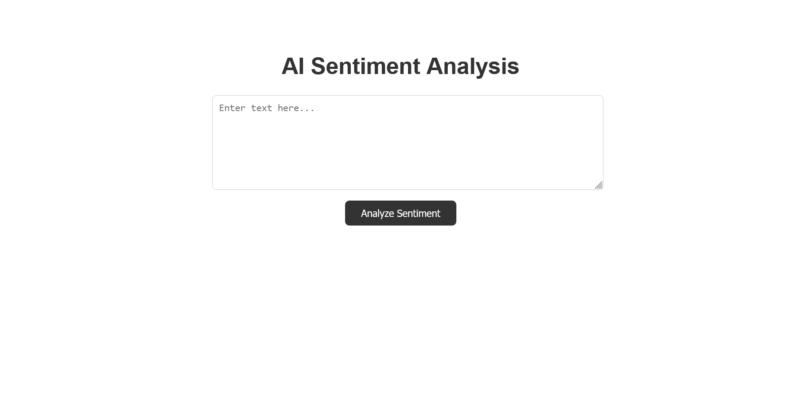
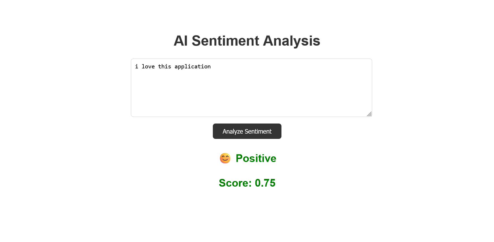
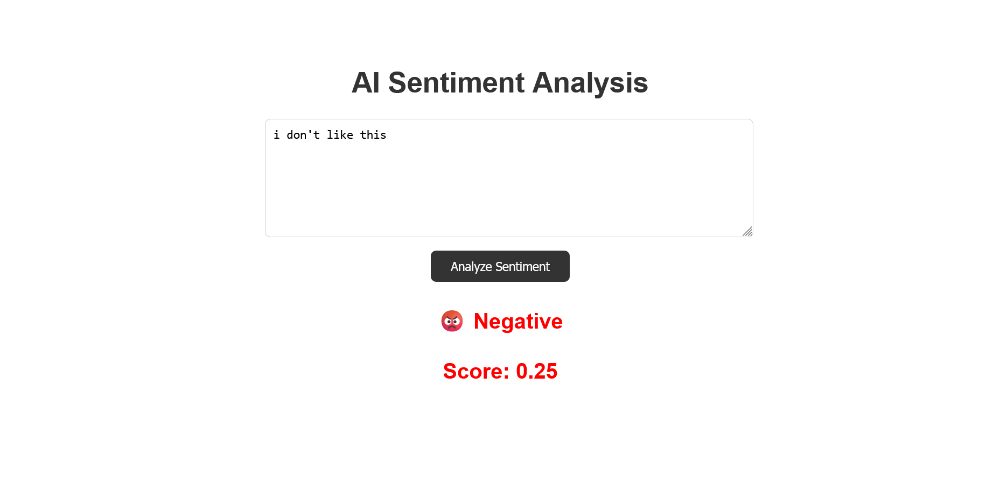

# AI Sentiment Analyzer

A full-stack AI-powered sentiment analysis application built using **Java Spring Boot** and **Stanford CoreNLP**.  
The application analyzes user-entered text and predicts its sentiment with a sentiment score and visual emoji feedback.


# Features

- AI-powered sentiment analysis
- REST API backend
- Interactive frontend UI
- Sentiment score generation
- Emoji-based sentiment visualization
- Input validation handling
- Real-time frontend/backend communication


# Tech Stack

| Technology | Purpose |
|---|---|
| Java 21 | Backend development |
| Spring Boot | REST API framework |
| Stanford CoreNLP | NLP sentiment analysis |
| Maven | Dependency management |
| HTML/CSS/JavaScript | Frontend UI |


# Project Architecture

```text
Frontend UI
     ↓
Spring Boot REST API
     ↓
Sentiment Service
     ↓
Stanford CoreNLP Engine
```

# Screenshots

## Home Screen

```md

```

## Positive Sentiment Result

```md

```


## Negative Sentiment Result

```md

```

# API Endpoint

## Analyze Sentiment

### Request

```http
POST /api/analyze
```

### Example Request Body

```json
{
  "text": "I absolutely love this project"
}
```

### Example Response

```json
{
  "sentiment": "Very positive",
  "score": 0.95
}
```

# Run Locally

## Clone Repository

```bash
git clone https://github.com/althaffazil/sentiment-analyzer
```

## Navigate Into Project

```bash
cd sentiment-analyzer
```

## Run Application

### Windows

```powershell
.\mvnw.cmd spring-boot:run
```

### Linux / macOS

```bash
./mvnw spring-boot:run
```

# Access Application

Open browser:

```text
http://localhost:8080
```
